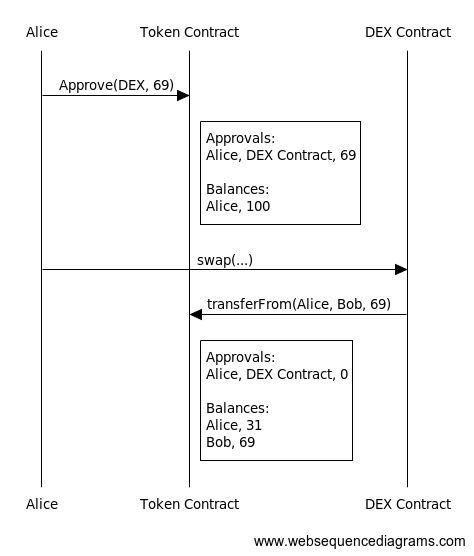

##### Web3 Show & Tell
### How I built a Safe App from scratch
#
#
#
##### Manuel Gellfart

 &nbsp;&nbsp;&nbsp;&nbsp;&nbsp; 
@schmanu | @schmanu_


---
### About me

- worked in web2 the past 8 years
- tiptoed into web3 one year ago via [**CSV Airdrop**](https://github.com/bh2smith/safe-airdrop) app
- joining the Gnosis Safe frontend team in May
#
#
#
---
### Token Approval Manager
---
### Idea of new Safe App


---
### Idea of new Safe App


---

### Approvals in ERC20



---

### Unlimited Approvals

- max value of `uint256`: `approve(0xffff...ffff)`
- exist until revoked `approve(0)`
- Convenience vs Security [[1]](https://blocksecteam.medium.com/unlimited-approval-in-erc20-convenience-or-security-1c8dce421ed7)
---

### Tools and Libraries


---
### Tools and Libraries

- Interacting with Gnosis Safe
[safe-apps-react-sdk](https://github.com/gnosis/safe-apps-sdk/tree/master/packages/safe-apps-react-sdk) & [Transaction Service API](https://safe-transaction.gnosis.io/) & [safe-react-gateway-sdk](https://github.com/gnosis/safe-react-gateway-sdk)
- User Interface
[safe-react-components](https://github.com/gnosis/safe-react-components) & [material-ui](https://github.com/mui/material-ui) & [styled-components](https://github.com/styled-components/styled-components)
- Interacting with smart contracts
[typechain](https://github.com/dethcrypto/TypeChain) & [@openzeppelin/contracts](https://github.com/OpenZeppelin/openzeppelin-contracts) & [ethers](https://www.npmjs.com/package/ethers)
---

### Getting Started

```bash
npx create-react-app my-app 
--template @gnosis.pm/cra-template-safe-app

cd my-app
yarn start
```


---
### Loading the safe

```tsx
<SafeProvider loader={
  <>
    <Title size="md">Waiting for Safe...</Title>
    <Loader size="md" />
  </>
}>
  <Application />
</SafeProvider>
```

---

```tsx
const SafeApp = (): React.ReactElement => {
  const { safe } = useSafeAppsSDK();
  const { safeAddress, chainId, owners, threshold } = safe;
}
```

---
#### Creating transaction data
```bash
typechain --target=ethers-v5 --out-dir src/contracts 
'./node_modules/@openzeppelin/contracts/build/contracts/ERC20.json'
```

---
### Fetching allowances (I)
```tsx
await getTransactionHistory(baseApiURL, network, safeAddress)
```
```tsx
await getTransactionDetails(baseApiURL, chainID, transaction.id)
```
---
### Fetching allowances (II)
```tsx
export const getAllowance = async (
  ownerAddress: string,
  tokenAddress: string,
  spenderAddress: string,
  provider: SafeAppProvider,
): Promise<BigNumber> => {
  const web3 = new ethers.providers.Web3Provider(provider);
  const contract = ERC20__factory.connect(tokenAddress, web3);
  return await contract.allowance(ownerAddress, spenderAddress);
};
```
---
#### Creating approval TXs

```tsx
export type ApprovalEdit = {
  tokenInfo: TokenInfo;
  spenderAddress: string;
  newValue: BigNumber;
};

export const createApprovals = (approvals: ApprovalEdit[]) => {
  const erc20Interface = ERC20__factory.createInterface();
  const txList = approvals.map((approval) => ({
    to: approval.tokenInfo.address,
    value: '0',
    data: erc20Interface.encodeFunctionData('approve', [
      approval.spenderAddress,
      toWei(approval.newValue, approval.tokenInfo.decimals).toFixed(),
    ]),
  }));
  return txList;
};
```
---
#### Submitting transactions (in batch)
```tsx
const { sdk } = useSafeAppsSDK();
const txs = createApprovals(approvalEntries);
const response = await sdk.txs.send({ txs });
if (response?.safeTxHash) {
    setSuccess(true);
}
```
---

### Token Approval Manager (Demo)

https://github.com/schmanu/token-approval-tracker

---

### Summary

- Batch transactions are easy within safe apps
- Building a prototype is fast
- A review process is really helpful

---

# Questions?

